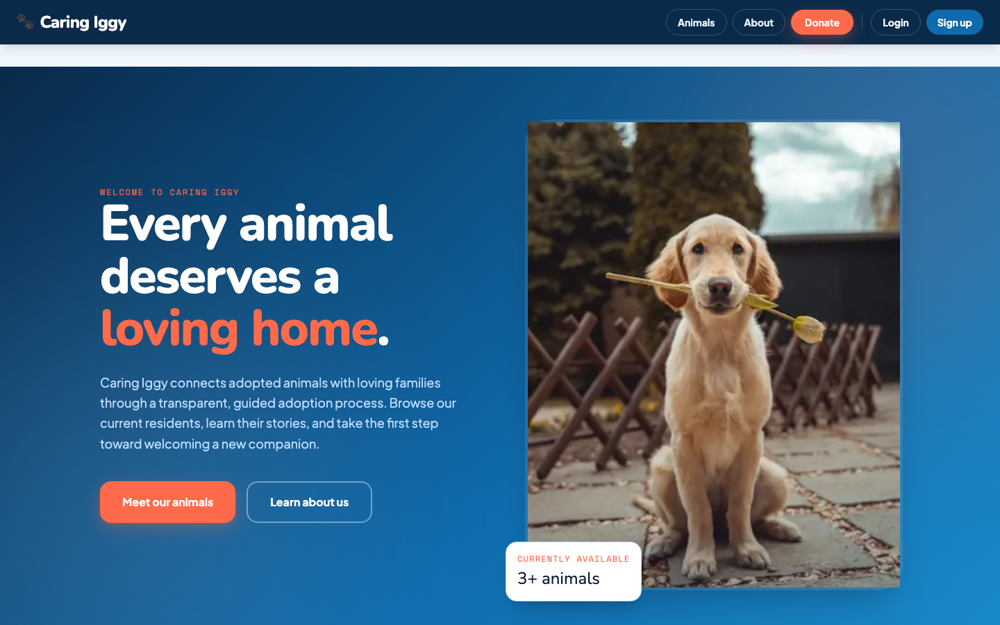
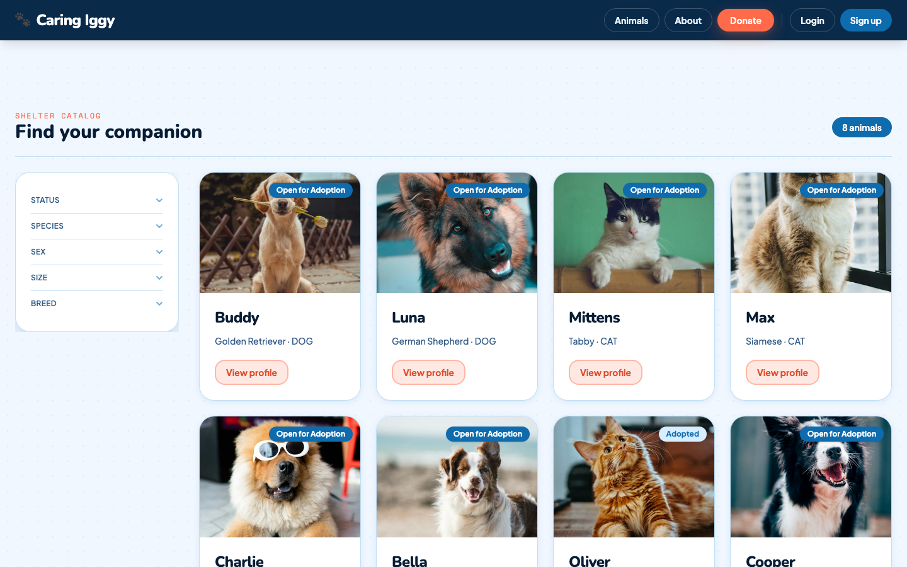
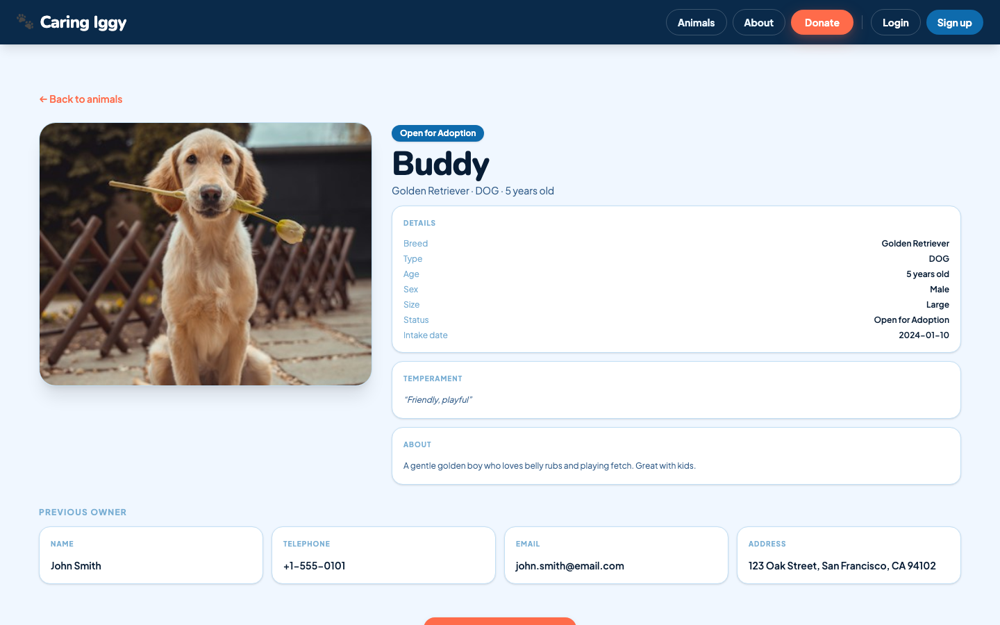
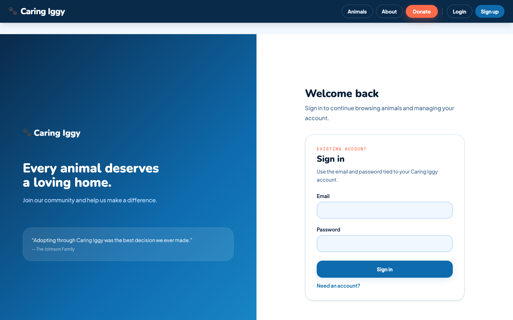
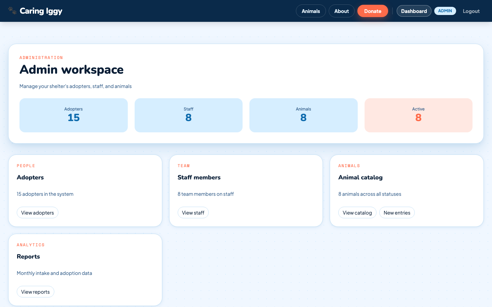
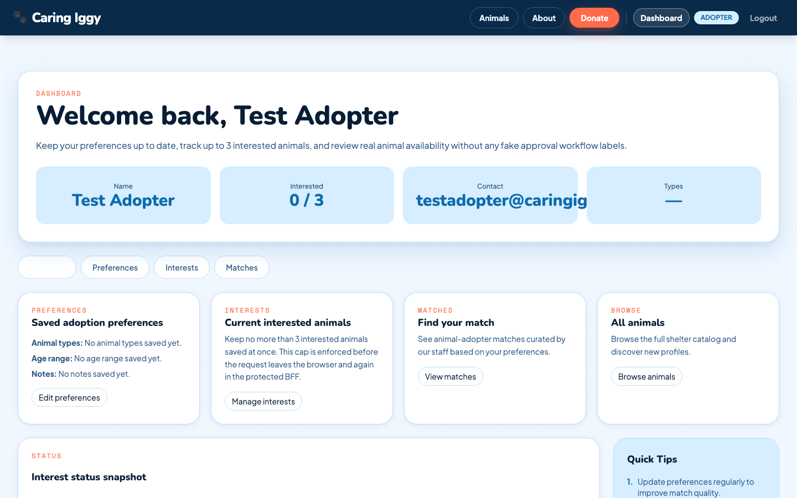
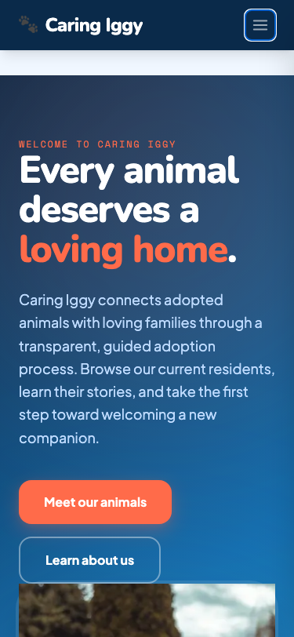

# Caring Iggy

*Every animal deserves a loving home.*

Caring Iggy is a website that helps an animal shelter find homes for the animals in its care. Visitors can browse the animals, read their stories, and say "I'm interested." Shelter staff keep the animal profiles up to date, and the shelter's administrator manages everyone's accounts.

## Who uses it, and what can they do?

**Visitors and adopters** can browse the full catalog of animals, filter by the kind of companion they're looking for, and open any animal's profile to learn its story. Once signed up, an adopter can save their preferences and mark up to three animals they're interested in.

**Shelter staff** can do everything an adopter can, plus add new animals to the catalog, edit their details, and update their status (for example, marking an animal as adopted).

**The shelter administrator** can do everything staff can, plus manage the people: creating staff accounts and overseeing adopter accounts.

## How it's built

The whole system is a small team of cooperating programs, each with a clear job.

**The website you see — Next.js and React.** The pages are built with Next.js 16 and React 19, styled with Tailwind CSS. It works on phones and desktops alike: the layout rearranges itself to fit the screen.

**The front door — Kong.** All traffic from the website to the inner services goes through one checkpoint called Kong. It checks that requests carry a valid login token, throttles repeated login attempts to slow down password guessing, and makes sure only the website — never the public — can reach the inner services. Every inner address stays invisible to the outside world.

**The workers — five Spring Boot services.** Behind the door, five small Java programs each do one job: one keeps track of the animals, one keeps track of adopters and their interests, one handles logins and accounts, one matches adopters with animals based on their preferences, and one produces summary reports for the shelter. They're built with Spring Boot 4 and plain Java, with no exotic machinery.

**The filing cabinets — one database each.** Each worker keeps its records in its own PostgreSQL database. The animal worker's files can't be reached by the adopter worker, and so on. If one part of the system needs care, the others keep working.

## Why it's built this way

**One front door.** Everything you see in the browser comes from a single website. The inner services never speak to the public directly, which leaves far less to defend.

**Wristbands, not ID cards.** Your login is an invisible wristband stored in your browser, not a plastic card you wave around. When the website needs to ask a worker for something private, it quietly trades the wristband for a short-lived pass at the front door. Passes expire quickly, so a stolen one doesn't stay useful for long.

**One job per worker.** Each of the five services has a single responsibility and its own files. Changes stay small and contained, and a mistake in one corner can't topple the whole shelter.

**Safety locks.** Anything that changes data (saving an animal, editing a profile) requires a secret second key that only the website and your browser share — so a random page elsewhere on the internet can't make changes on your behalf. Logins are rate-limited at the door. Sensitive configuration never lives in the code.

**Tested like a user.** The site is exercised end to end with real browser automation (Playwright): signing in, browsing, filtering, and editing all happen through the same pages a person would use, and the test logins are saved and reused exactly the way a returning visitor's session would be. The same suite checks the front door's rules — that strangers are turned away, and that login attempts get throttled.

## Take a look around

**The animal catalog**, with filters for status, species, sex, size, and breed:

**An animal's profile**, with details, temperament, and the previous owner's contact information:

**Signing in** — the front door asks for your email and password:

**The shelter administrator's workspace**, with a bird's-eye view of adopters, staff, and animals:

**An adopter's dashboard**, where preferences and interests live:

**The same site on a phone** — one column, everything stacked, nothing cut off:

## Deployment

The project includes a single-host AWS deployment; the operational details live in [infrastructure/aws/README.md](infrastructure/aws/README.md).
